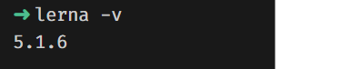

# Lerna

## Commands

### `init`

We’ll start by generating a Lerna config with lerna init.

```bash
lerna init
```

If you prefer the independent mode, add --independent to the command.

```bash
lerna init --independent
```

### `list`

List packages.

```bash
lerna ls
```

### `create`

Create a new lerna-managed package.

```bash
lerna create <name> <loc>
```

### `bootstrap`

Download NPM dependencies and cross-link packages in the repository.

```bash
lerna bootstrap
```

### `version`

Push all the changes to the remote repository and creates a Git tag.

```bash
lerna version
```

### `publish`

Publish packages in the current project.

```bash
lerna publish [bump]
```

## Flags

### `--help`

Show help.

```bash
lerna --help
lerna -h
```

### `--version`

Show version number.

```bash
lerna --version
lerna -h
```


